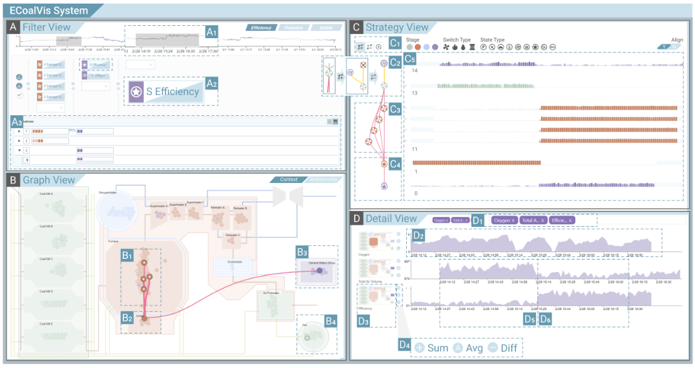
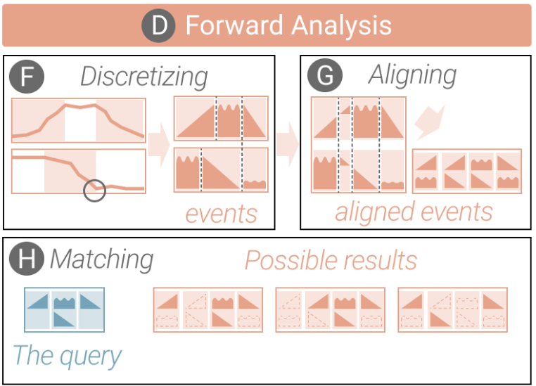
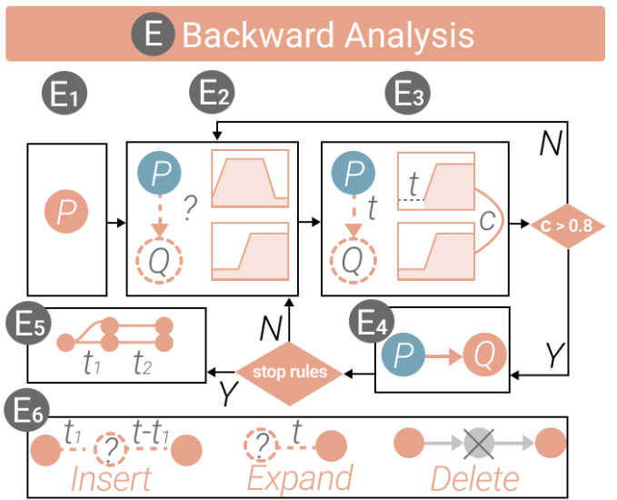
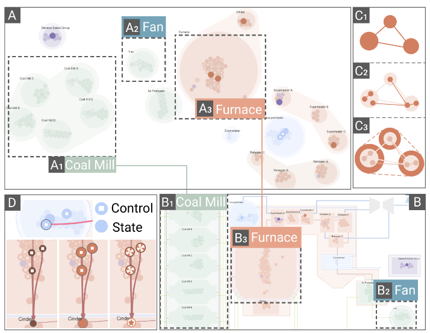
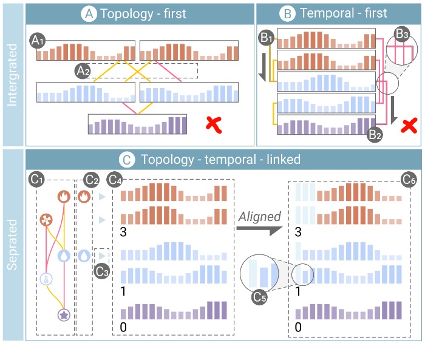
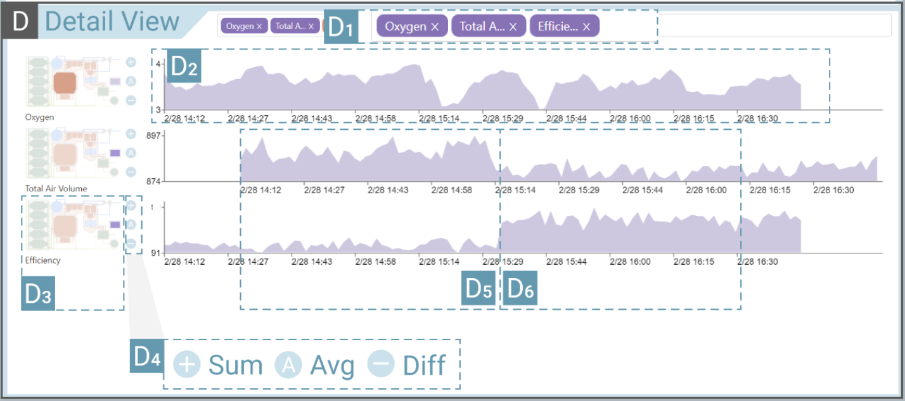

## ECoalVis: Visual Analysis of Control Strategies in Coal-fired Power Plants

> *Lastest Update: 25th April 2024*

#### Introduction
a novel interactive system visually analyze the **control strategies** of coal-fired power plants extracted from historical sensor data.

 

#### Motivation
- Environment
- Risky
- Limited datasets and strong assumptions
- Difficult to capture the potential spread of the impact of control strategies

 

#### **Challenges**
- Extraction of control strategies
- Cascading impact
- Time-lag-aware analysis

 

#### Requirement and design
- [R1] Extract the impact of control strategies with time series queries (forward)
  - Discretizing time series
  - Aligning sensor events
  - Matching partial strategy
  
- [R2] Identify responsible control strategies for anomalies in important sensors (backward)
  - Time-lag-aware breadth-first search
  
- [R3] Explore the spatial propagation of control strategy impact
  - relationship-oriented/Context-oriented
  
- [R4] Obtain the temporal cascading of control strategy impact
  - topology-temporal-separated
  
- [R5] Inspect the details of the sensor time series

#### **Critical thinking**

- Multi-dimensional visualization
- Link
- Extend to other domains with strong temporal correlation

