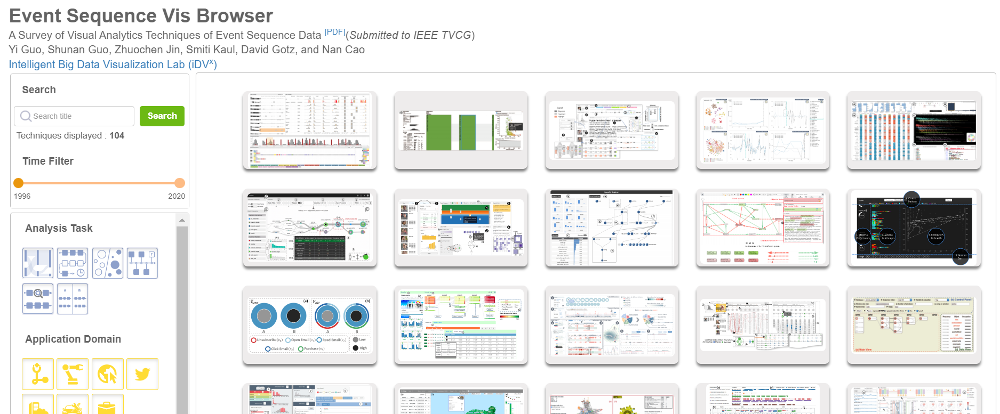
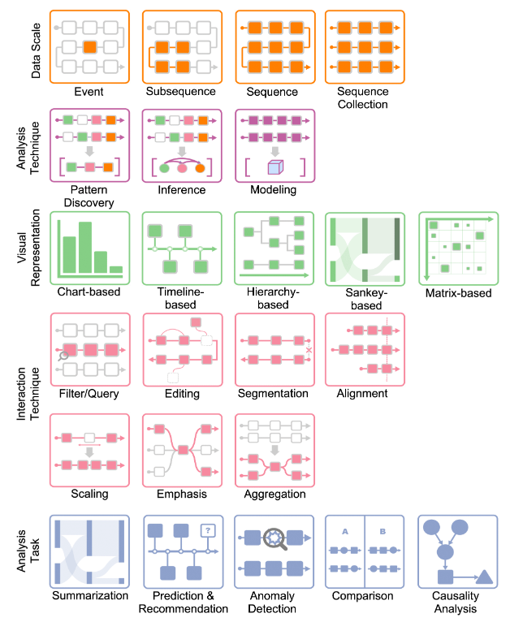

## Survey on Visual Analysis of Event Sequence Data

> *Lastest Update: 29th April 2024*

### Introduction

The aim of this [survey](http://eventvis.idvxlab.com/) is to provide a comprehensive review and characterization of the state-of-the-art in visual analytics research for event sequence data.

 

### Taxonomy
#### Design Space

- Data Scales
  - Event
  - Subsequence
  - Sequence
  - Sequence Collection
- Analysis Techniques
  - Pattern discovery
    - frequent pattern mining
    - similarity analysis
  - Sequence inference
  - Sequence modeling
- Visual Representations
  - Chart-based visualizations
  - Timeline-based visualizations
  - Hierarchy-based visualizations
  - Sankey-based visualizations
    - directed node-link graph
    - traditional Sankey diagram
  - Matrix-based visualizations
- Interactions
  - Filter/query
  - Editing
  - Segmentation
  - Alignment
  - Scaling
  - Emphasis
- Visual Analysis Tasks
  - Summarization
  - Prediction & recommendation
  - Anomaly detection
  - Comparison
  - Causality analysis

