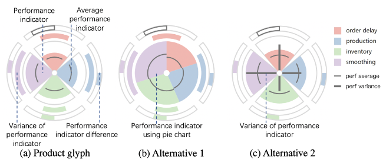

## **PlanningVis**: A Visual Analytics Approach to Production Planning in Smart Factories

> *Lastest Update: 2nd April 2024*

#### Introduction

A visual analytics system to facilitate the efficient optimization of daily production planning and support a quick response to unanticipated incidents in manufacturing.

 

#### Challenge

- The large amount of manufacturing data and its complexity
- The relationships between products and machines are complex
- Analyze the influence of a sudden change
- The identified disease progression patterns need to be associated with other variables

 

#### Highlights

- Iterative visualization design

- Linked view

#### Critical thinking

- Burden of understanding