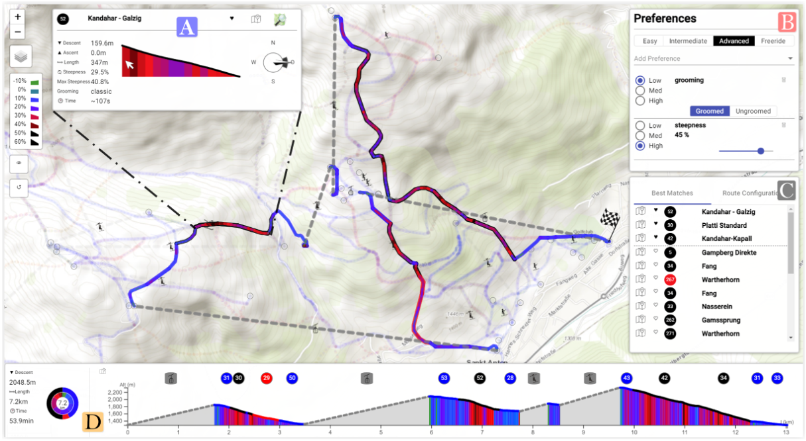
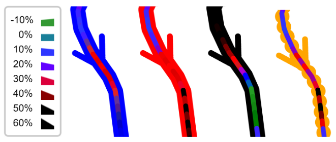
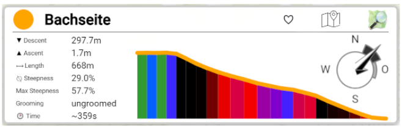
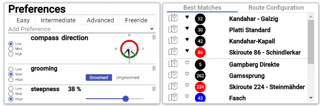
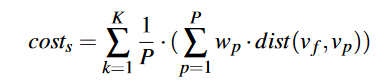

## SkiVis: Visual Exploration and Route Planning in Ski Resorts

> 更新时间：2024/04/23

#### Introduction

What: A visual analytics application to interactively **explore ski slopes** and provide **routing recommendations based on user preferences**.

 

#### Related Work

- Ski Visualizations

  - The painted panorama style distorts the underlying topography to emphasize certain memorable features

    

  - Metro map

  - Preference-based visualization techniques reduce time required for route planning

  - Visualizing slopes by a color-coded line according to their difficulty

  - Display further information on individual slopes

- Routing in Geospatial Networks

 

#### Motivation

**Research Gap**: No analysis approach exists that enables the visual exploration of the resort and interactively provides routing recommendations based on user-defined preferences.

- The painted panorama style distorts the underlying topography to emphasize certain memorable features

- Display further information on individual slopes
- Most approaches for route planning focus on other outdoor activities such as cycling or hiking

- Neglect user-specific preferences

 

#### Requirement and design

- [T1]Exploration of a ski resort according to the defined features 
  
  - Double-line visual approach consisting of an outer and inner line

    
  
  - Tooltip
  
    
  
- [T2]Provide a ranking based on preferences toward these features 

  

- [T3]Allow routing between two arbitrary network points Neglect user-specific preferences
  
- Dijkstra
  
- [T4]Integrate preferences into the routing algorithm
  - Compute cost for each slope according to the user preferences
  
    
  
  - Automated/semi-automated workflow

 

#### Critical thinking

- New area ?
- Color encoding
- Satisfy the collective preference