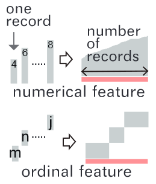

## **ThreadStates**: State-based Visual Analysis of Disease Progression

> *Lastest Update: 1st April 2024*

#### Introduction

Explore disease progression status in longitudinal patient cohort data and reveal the association between disease progression and other variables.

 

#### Motivation

- Capabilities in modeling disease progression are not fully utilized
- The large number of observations, the complex correlation between observations, and the existence of irrelevant observations 
- A disease can exhibit different progression patterns within a target patient cohort
- The identified disease progression patterns need to be associated with other variables

 

#### Highlights

- Dimension reduction and clustering

- A novel glyph design to depict the feature distribution

- more details about selected state transitions

- Address the false sense of transitions between multiple timepoints caused by Sankey-based visualizations

#### **Critical thinking**

- Incorporate domain knowledge into the model

